# Text Classification

##  Table Of Content

- Introduction

- Dataset Used

- Technologies & Tools Used

- Model Architecture

- How to Run

- Results

- Methodology

- Future Enhancements

- Author

##  Introduction

In the age of digital finance and consumer empowerment, regulatory bodies and financial institutions have become increasingly reliant on large-scale textual data to monitor and improve customer satisfaction. The Consumer Complaint Database—a publicly available dataset released by the Consumer Financial Protection Bureau (CFPB)—contains millions of real-world complaints submitted by consumers regarding financial products and services.

The primary objective of this task is to build an intelligent text classification system that can automatically categorize consumer complaints into predefined categories. This includes four specific classes of interest:

0 – Credit reporting, repair, or other

1 – Debt collection

2 – Consumer Loan

3 – Mortgage

Given the high volume and unstructured nature of the data, this project leverages Natural Language Processing (NLP) and Machine Learning techniques to transform raw text into meaningful numerical representations using TF-IDF vectorization, followed by training a Logistic Regression model with balanced class weighting to counteract class imbalance.

Furthermore, the model’s performance is evaluated through key metrics such as accuracy, precision, recall, F1-score, and a detailed confusion matrix to better understand the classification behavior across the chosen categories.

This system has real-world implications for automatically routing, prioritizing, and analyzing consumer issues—helping financial institutions respond more effectively and regulatory agencies identify systemic risks early.

---

##  Dataset Used

The dataset is derived from the Consumer Financial Protection Bureau (CFPB) complaint database. After preprocessing and TF-IDF vectorization, the following four target classes are considered:

1. Credit reporting, repair, or other
2. Debt collection
3. Consumer Loan
4. Mortgage

- Training Samples: X_train.npz (TF-IDF vectors), y_train.npy
- Testing Samples: X_test.npz, y_test.npy

### Dataset Link: 

-[Consumer Complaint Dataset](https://drive.google.com/file/d/1au4y36fomdcN-eIOV9JJpn6Nk0oPQuGH/view?usp=sharing)

---

##  Technologies & Tools Used

- Python
- Scikit-learn
- XGBoost
- NumPy, SciPy
- Matplotlib & Seaborn
- Google Colab
- Git & GitHub

---

##  Model Architecture

Four supervised learning models were used:

1. Logistic Regression 
2. Multinomial Naive Bayes 
3. Random Forest Classifier 
4. XGBoost Classifier 

### Key Steps

- TF-IDF Vectorization of complaint texts
- Handling class imbalance with compute_class_weight and tuning
- Training, evaluating, and comparing models
- Saving best model to .pkl

---

##  How to Run

### 1. Clone the Repository
git clone 
https://github.com/Hareesh202003/Text-Classification.git
cd Text-Classification

1. Upload the following files to your Google Drive:
   - X_train.npz, X_test.npz
   - y_train.npy, y_test.npy
2. Mount Google Drive in your Google Colab notebook.
3. Run the script provided in the repository.
4. Outputs:
   - Confusion matrices saved in /Complaints/
   - Final model saved as best_model.pkl
   - Bar chart comparing recall scores saved as recall_comparison.png

---

##  Methodology

- Step 1: Load preprocessed and vectorized data.
- Step 2: Calculate class weights with emphasis on improving "Consumer Loan".
- Step 3: Define and train models.
- Step 4: Evaluate using recall_score and classification_report.
- Step 5: Save confusion matrix plots and best model.
- Step 6: Plot weighted recall for comparison.

---

##  Results

- A bar chart visualizes the recall score across all models.
- Final best model saved using weighted recall as the selection metric.
- The execution screenshots are attached below:
- 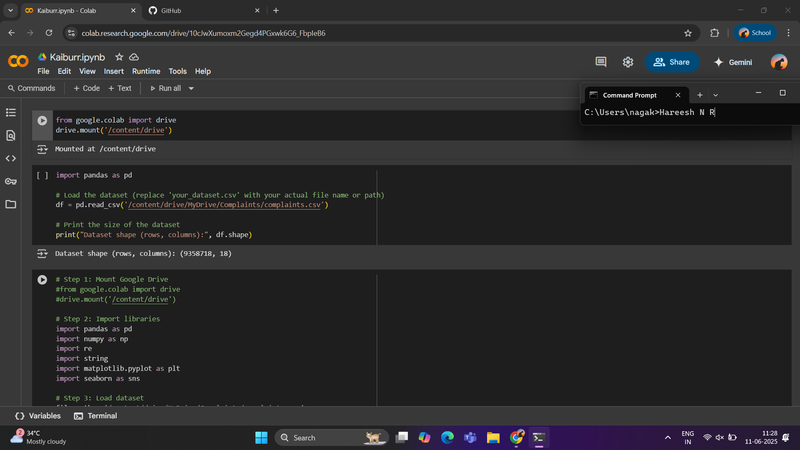
- 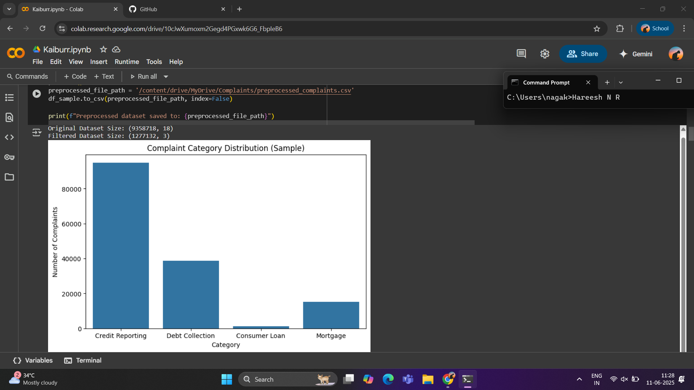
- 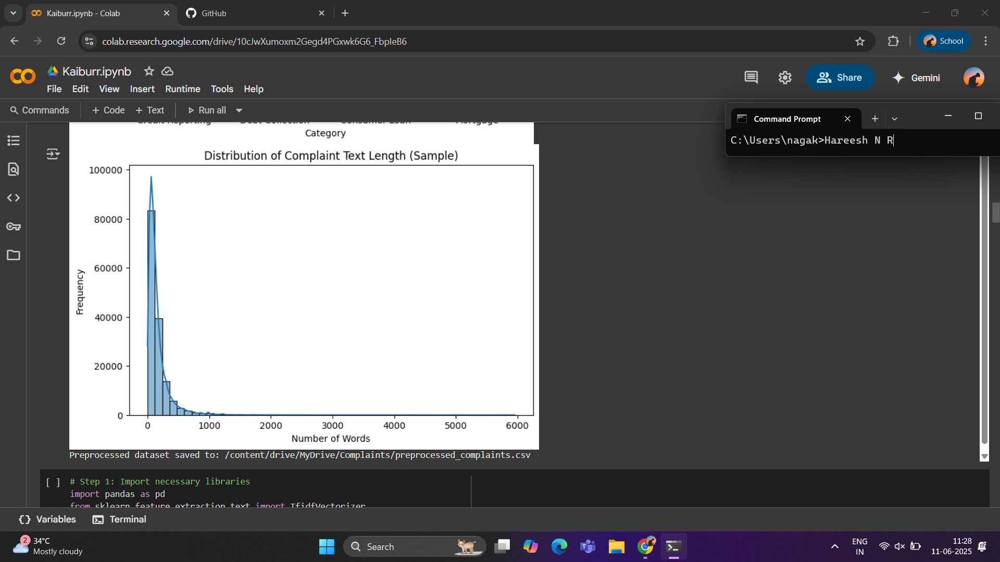
- 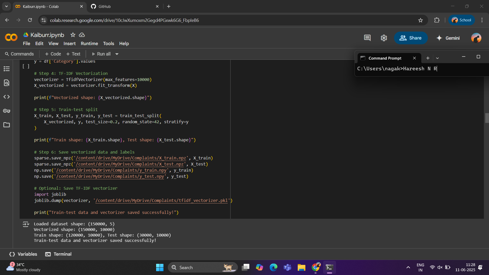
- 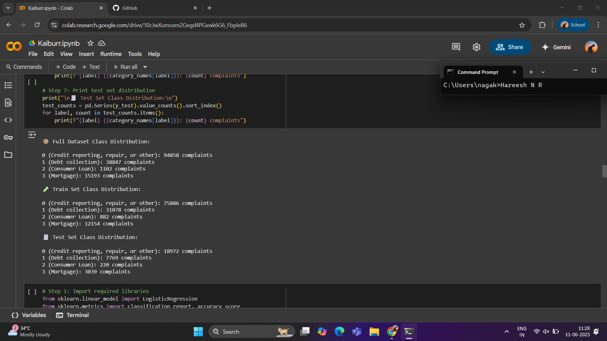
- 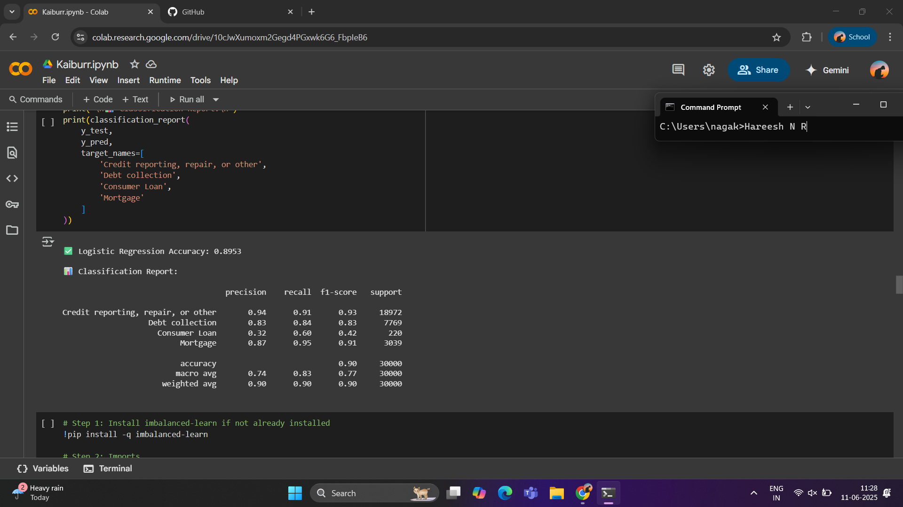
- 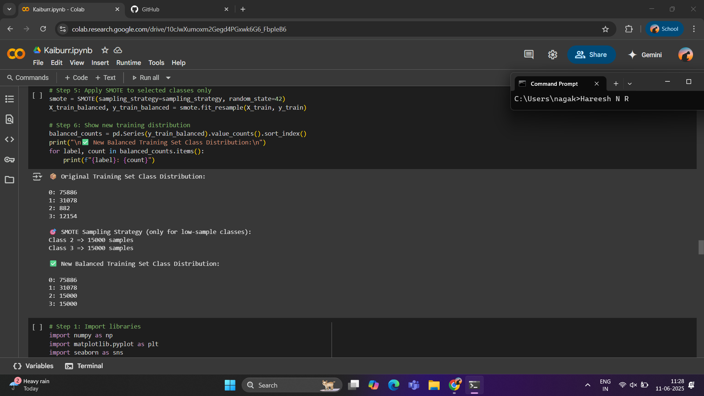
- 
- 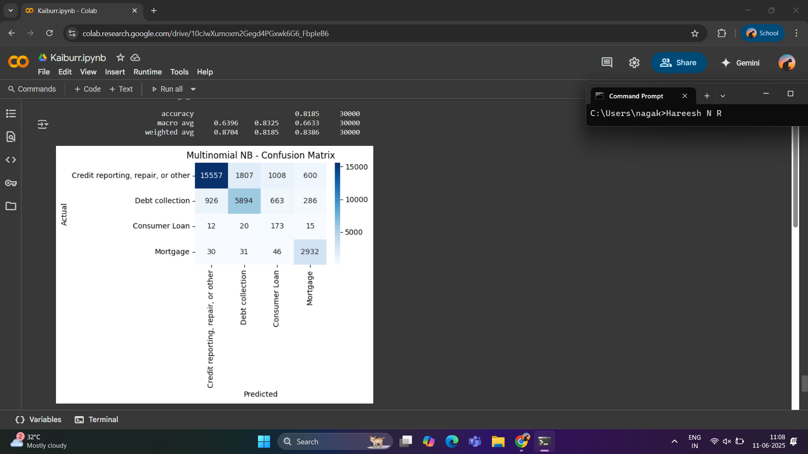
- 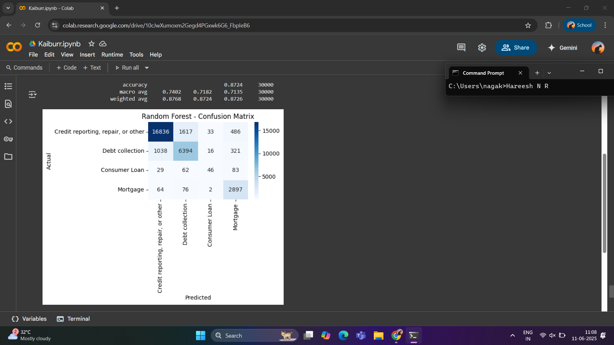
- 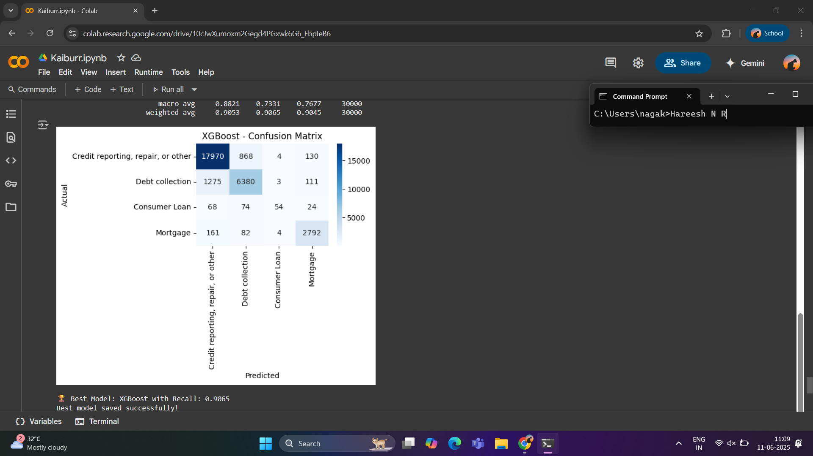
- 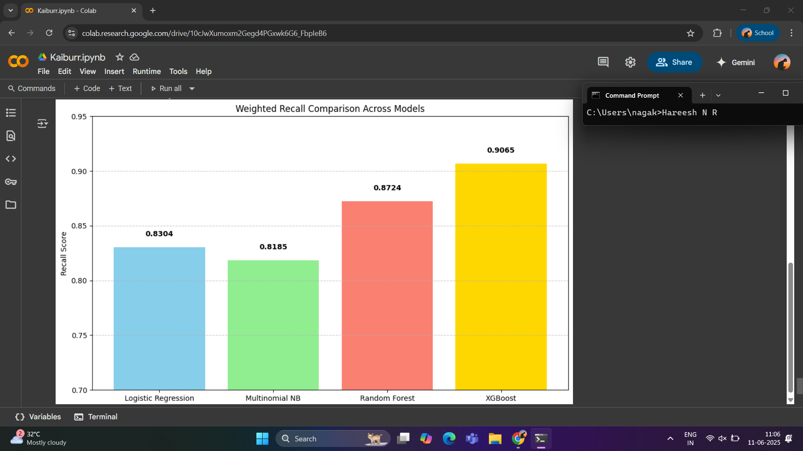

---

### Confusion Matrix for All Models

Confusion matrices for each classification model have been generated to evaluate the performance across all four complaint categories:

- Credit reporting, repair, or other  
- Debt collection  
- Consumer Loan  
- Mortgage

These matrices visually represent the model's ability to correctly classify and highlight areas of misclassification.

### Logistic Regression  
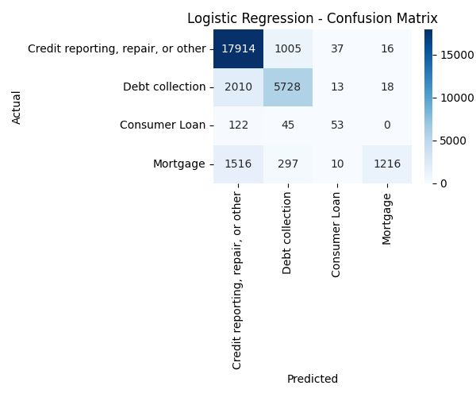

### Multinomial Naive Bayes  
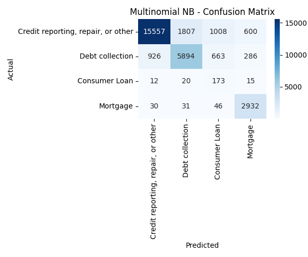

### Random Forest  
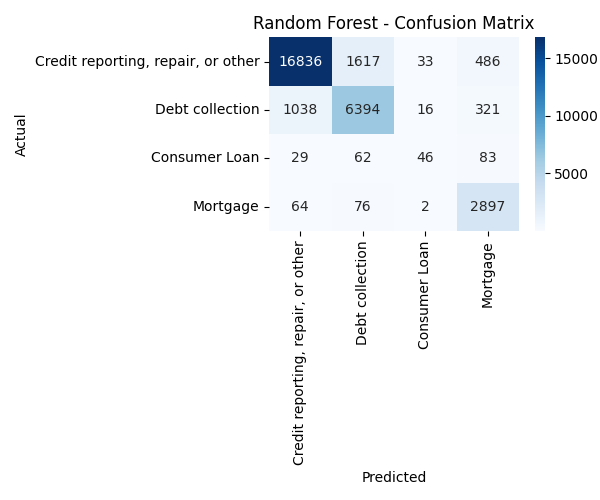

### XGBoost  
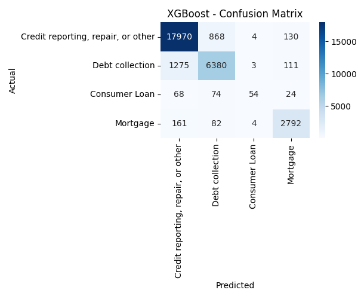

---

### Recall Score Comparison

A bar chart was plotted to compare the weighted recall scores across different models. This metric helps evaluate how well each model performed in capturing the true positives for all classes, especially important for imbalanced datasets.

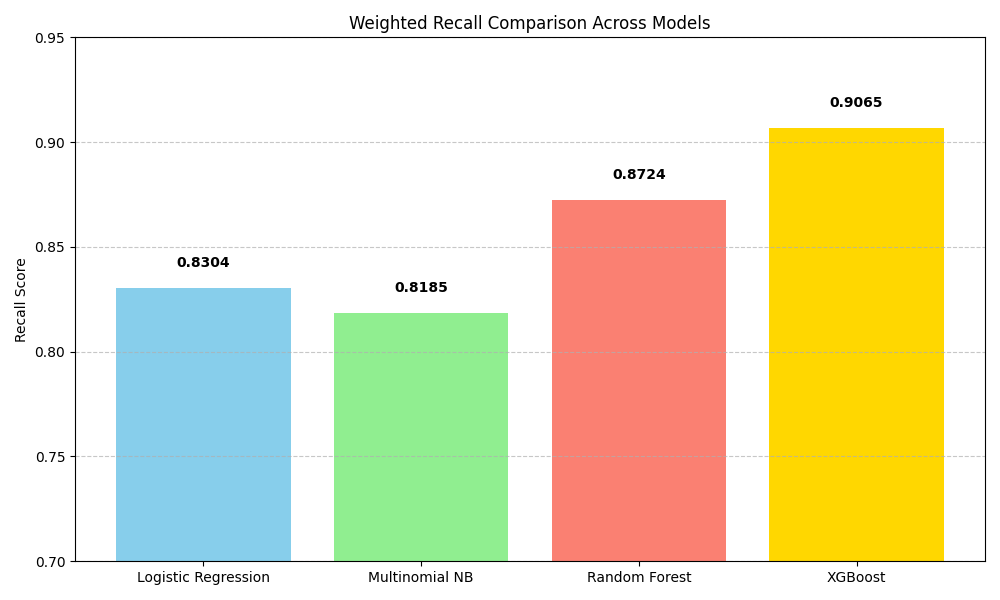

---

### Drive Link
-[Click here to open Google Drive Folder](https://drive.google.com/drive/folders/1KJxc78jWJvxsbH7GgdFSyqPVwttin5lj?usp=sharing)

---

##  Future Enhancements

- Integrate deep learning models like BERT for text embedding.
- Deploy the best model using a REST API or Streamlit app.
- Add more preprocessing like named entity removal or lemmatization.

---

##  Author

Name: Hareesh202003
GitHub: > [https://github.com/Hareesh202003/Text-Classification]{.underline}
Date:11/06/2025

---
